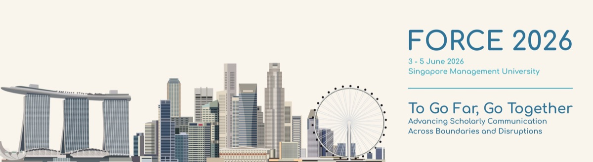
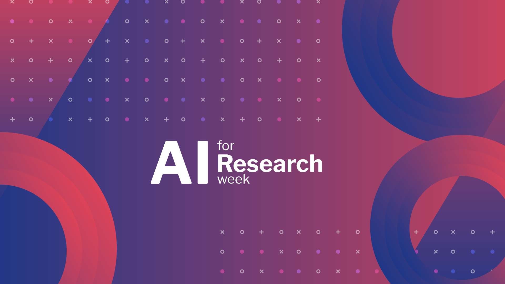
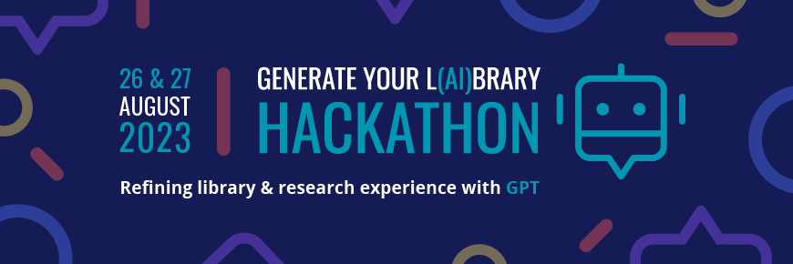
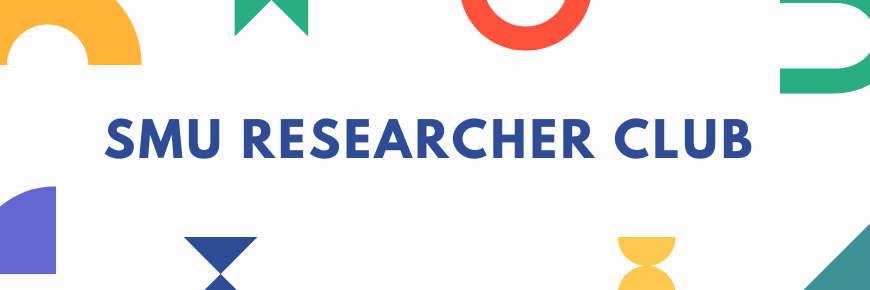

A selected list of projects, learning resources, and community initiatives that reflect my work in research data services, AI-enabled research workflows, open scholarship, and researcher engagement.

## Tools & Resources I've Built

### Open Science Knowledge Check

A self-assessment quiz on open science and scholarly publishing, built with [Quarto](https://quarto.org/) and Observable JS. It helps librarians, researchers, and scholarly-communication enthusiasts gauge and build their understanding of open-science concepts at their own pace.

[Try the quiz](https://bellaratmelia.github.io/os-knowledge-check/){.btn .btn-outline-primary role="button"} [Source on GitHub](https://github.com/bellaratmelia/os-knowledge-check){.btn .btn-outline-secondary role="button"}

### Introductory R for Social Sciences

An open, self-paced course website for teaching R to social science students, built in collaboration with School of Social Sciences and taught at SMU since August 2023.

[View the course](https://smu-libraries.github.io/r-socsci/){.btn .btn-outline-primary role="button"} [Source on GitHub](https://github.com/smu-libraries/r-socsci){.btn .btn-outline-secondary role="button"} [Earlier materials](https://bellaratmelia.github.io/introductory-r-socsci/){.btn .btn-outline-secondary role="button"}

*More workshop and teaching materials are available on my [GitHub](https://github.com/bellaratmelia).*

:::{style="margin-top: 60px;"}
:::

## Initiatives & Events I've Led

### FORCE2026

{fig-alt="Banner for FORCE2026" width="45%"}

- Co-chaired FORCE2026, FORCE11's flagship conference; led a distributed organising committee spanning multiple continents, with oversight of program design and conference budget.

[Visit conference website](https://force11.org/force2026/)

### AI for Research Week 2024

{fig-alt="Banner for SMU Libraries AI for Research Week 2024" width="35%"}

- Led a team of seven in organising AI for Research Week 2024, defining the event scope, managing logistics, and coordinating speaker recruitment.
- Co-facilitated two hands-on workshops:
  - *[Try it together: Transcribing your audio with Whisper API](https://ink.library.smu.edu.sg/ai_research_week/Programme/Programme/3/)* — guiding participants through real-time transcription using the Whisper API.
  - *[Try it together - AI-powered search tools: Elicit, SciSpace, Connected Papers, ResearchRabbit, and Undermind.ai](https://ink.library.smu.edu.sg/ai_research_week/Programme/Programme/2/)* — demonstrating AI tools for literature discovery and research workflows, with Aaron Tay and Ooi Kooi Cheng.

[Visit project website](https://library.smu.edu.sg/AI4ResearchWeek#programme){.btn .btn-outline-primary role="button"}

### Generate Your L(AI)brary Hackathon 2023

{fig-alt="Banner for SMU Libraries Generate Your L(AI)brary Hackathon 2023" width="35%"}

- Led a team of eight in organising Generate Your L(AI)brary Hackathon 2023, overseeing the event scope, theme development, judge and mentor recruitment, and overall planning.
- Conducted an introductory Python workshop to equip participants with foundational skills in preparation for the hackathon.

[Visit project website](https://researchguides.smu.edu.sg/hackathon-2023){.btn .btn-outline-primary role="button"}

### SMU Researcher Club *(ongoing)*

{fig-alt="Banner for the SMU Researcher Club" width="35%"}

- Founding member of the SMU Researcher Club, an initiative that fosters community, collaboration, and knowledge sharing among researchers at SMU.
- Help curate events, workshops, and researcher-facing initiatives that support research staff, postgraduate researchers, and the wider SMU research community.

[Visit the club website](https://smu.sg/researcherclub){.btn .btn-outline-primary role="button"}